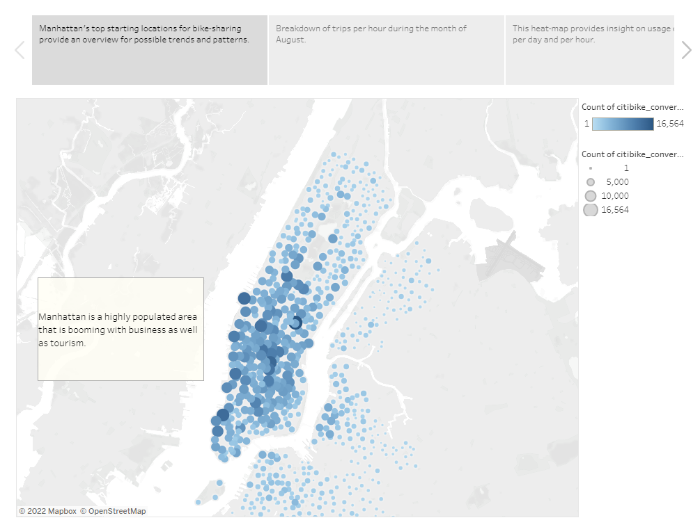
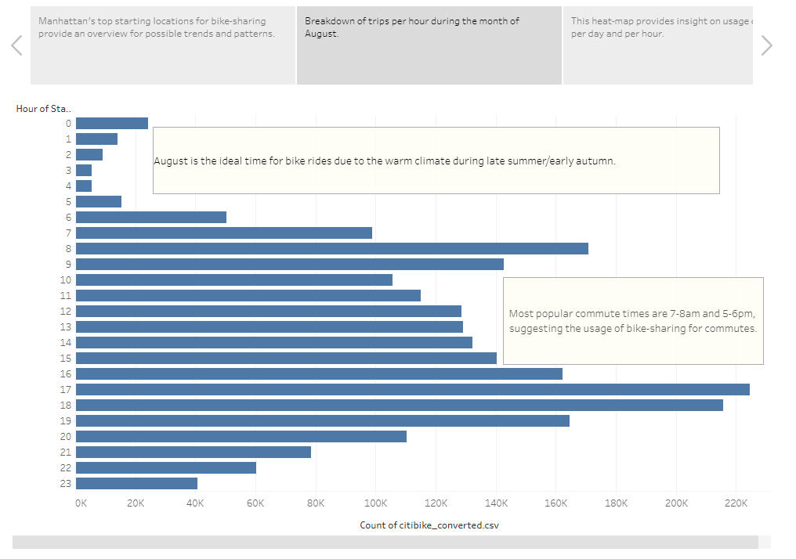
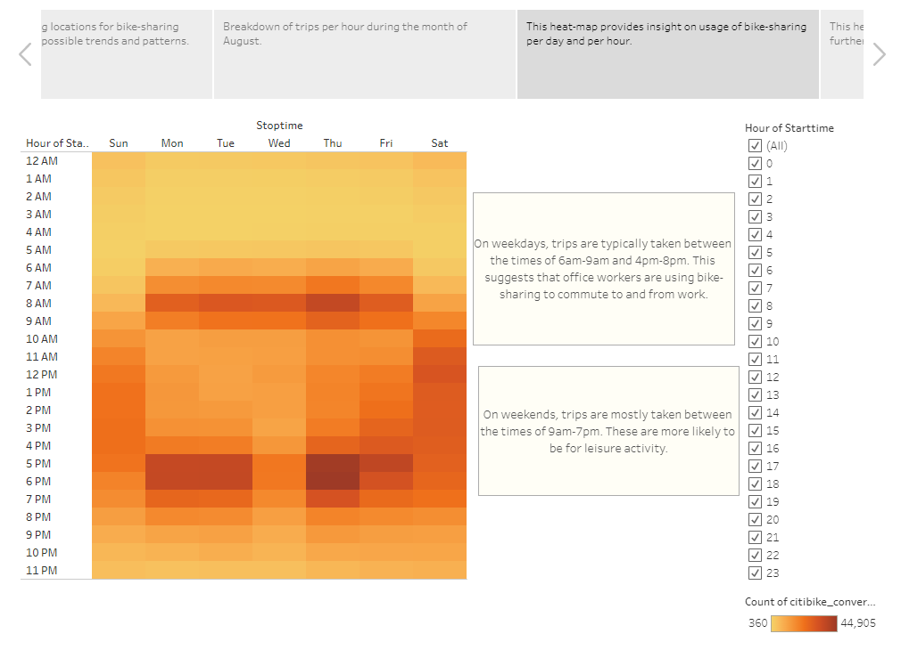
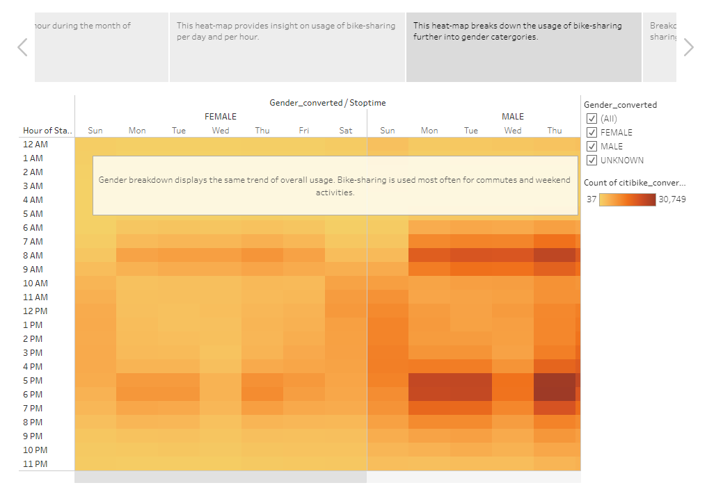
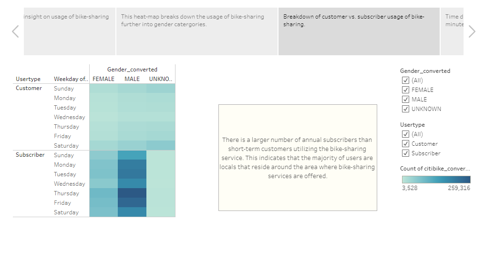
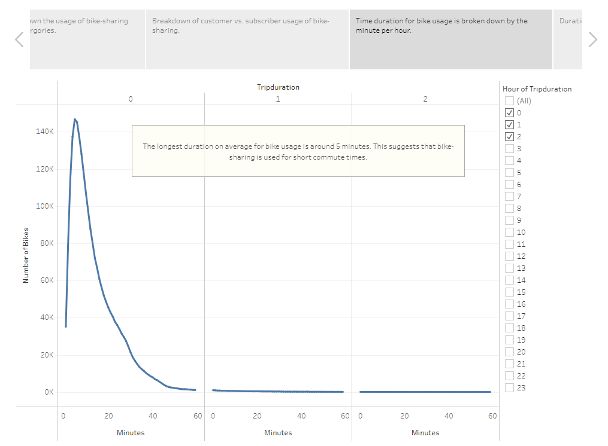
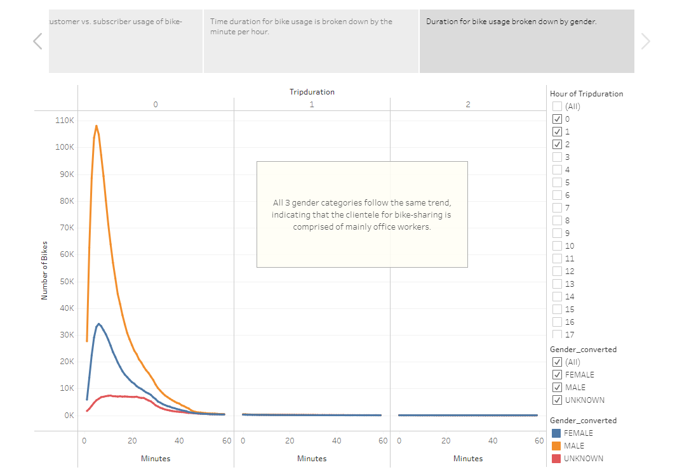

# Citi Bike Analysis

Tableau Dashboard can be accessed here: [NYC Citi Bike Analysis](https://public.tableau.com/views/NYCCitiBikeAnalysis_16686695380810/Story1?:language=en-US&:display_count=n&:origin=viz_share_link)

## Purpose
Utilizing Tableau and CSV data files, analysis was conducted to understand how the bike-sharing business in New York City functions. This dataset included target population demographic, popular start/end locations, and duration for bike-sharing. From this analysis, a proposal will be written and presented to a potential investor on how a bike-sharing business will potentially function in Des Moines, Iowa.

## Results
Below are the visualizations of the results from the analysis along with descriptions.

## Summary
Based on the results from the analysis, it can be seen that the main clientele for the bike-sharing business in New York City comes from local residents in the area. 
